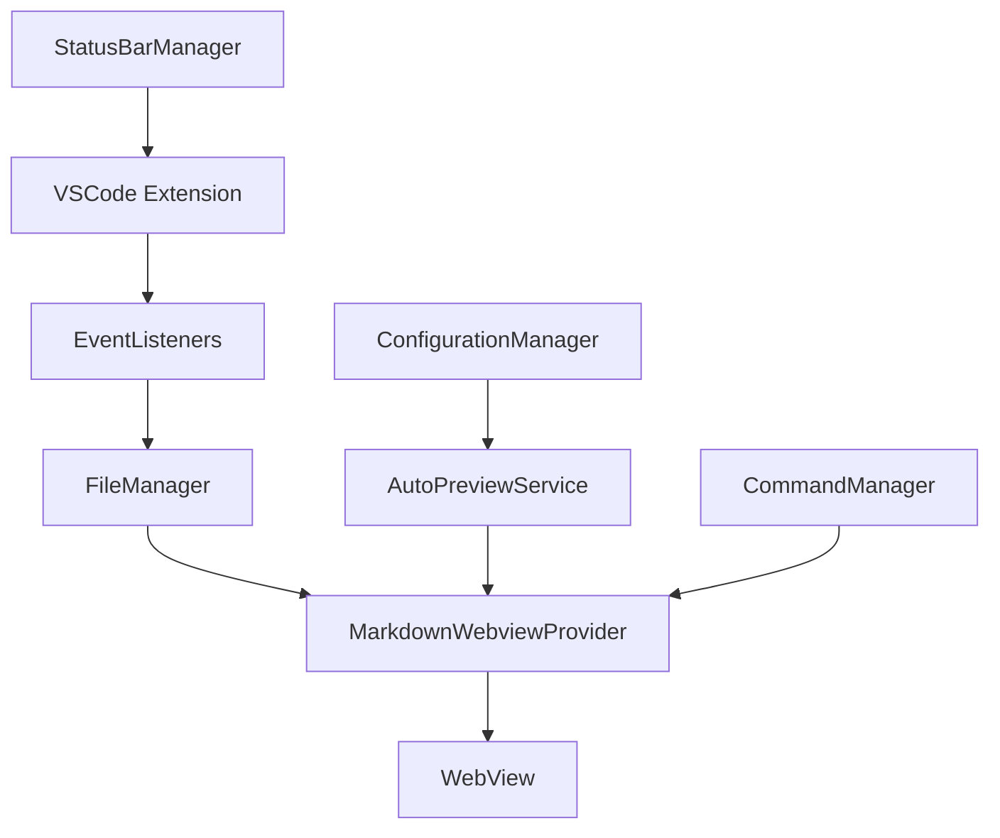

# Supernode Markdown VSCode Extension

一个基于面向对象设计（OOD）原则构建的 VSCode Markdown 预览扩展，提供实时预览、文件操作和智能配置管理功能。

## 🏗️ 整体架构

### 架构设计原则

本项目采用**面向对象设计（OOD）**原则，遵循以下核心设计模式：

- **单一职责原则（SRP）**: 每个类只负责一个特定功能
- **开闭原则（OCP）**: 对扩展开放，对修改封闭
- **依赖倒置原则（DIP）**: 依赖抽象而非具体实现
- **单例模式**: 确保全局唯一实例
- **策略模式**: 灵活的消息处理策略

### 目录结构

```
extension/src/
├── types/                    # 类型定义
│   └── messages.ts          # 消息接口定义
├── managers/                # 管理器层
│   ├── ConfigurationManager.ts  # 配置管理
│   ├── FileManager.ts           # 文件操作管理
│   └── StatusBarManager.ts      # 状态栏管理
├── commands/                # 命令层
│   └── CommandManager.ts    # 命令注册管理
├── listeners/               # 监听器层
│   └── EventListeners.ts    # 事件监听管理
├── providers/               # 提供者层
│   └── MarkdownWebviewProvider.ts  # WebView 提供者
├── services/                # 服务层
│   └── AutoPreviewService.ts      # 自动预览服务
└── extension.ts             # 主入口文件
```

## 🔧 核心模块详解

### 1. 类型定义层 (`types/`)

**职责**: 定义所有消息接口和数据结构

```typescript
// messages.ts - 消息类型定义
interface WebviewMessage {
  command: string;
  [key: string]: any;
}

interface UpdateMarkdownMessage extends WebviewMessage {
  command: "updateMarkdownContent";
  content: string;
  fileName: string;
}
```

**优势**:
- 类型安全，减少运行时错误
- 清晰的接口契约
- 便于IDE智能提示

### 2. 管理器层 (`managers/`)

#### ConfigurationManager
**职责**: 统一管理扩展配置

```typescript
export class ConfigurationManager {
  public getAutoOpenPreview(): boolean
  public getPreviewPosition(): string
  public setAutoOpenPreview(value: boolean): Thenable<void>
}
```

**特性**:
- 单例模式确保全局唯一
- 封装配置读写逻辑
- 提供类型安全的配置访问

#### FileManager
**职责**: 处理所有文件相关操作

```typescript
export class FileManager {
  public isMarkdownFile(document: vscode.TextDocument): boolean
  public async openLocalFile(relativePath: string, basePath?: string): Promise<void>
  public async updateMarkdownContent(filePath: string, content: string): Promise<boolean>
}
```

**特性**:
- 统一文件操作接口
- 异步操作处理
- 错误处理和日志记录

#### StatusBarManager
**职责**: 管理状态栏显示

```typescript
export class StatusBarManager {
  public show(): void
  public hide(): void
  public updateText(text: string): void
  public updateTooltip(tooltip: string): void
}
```

**特性**:
- 状态栏生命周期管理
- 动态内容更新
- 资源自动清理

### 3. 命令层 (`commands/`)

#### CommandManager
**职责**: 注册和管理所有VSCode命令

```typescript
export class CommandManager {
  public registerCommands(): vscode.Disposable[]
  public dispose(): void
}
```

**特性**:
- 统一命令注册入口
- 自动资源管理
- 便于扩展新命令

### 4. 监听器层 (`listeners/`)

#### EventListeners
**职责**: 处理各种VSCode事件监听

```typescript
export class EventListeners {
  public registerFileChangeListener(
    onMarkdownUpdate: (message: UpdateMarkdownMessage) => void
  ): vscode.Disposable
  
  public registerDocumentChangeListener(
    onMarkdownUpdate: (message: UpdateMarkdownMessage) => void
  ): vscode.Disposable
}
```

**特性**:
- 事件驱动的架构
- 回调函数解耦
- 自动资源清理

### 5. 提供者层 (`providers/`)

#### MarkdownWebviewProvider
**职责**: 管理WebView面板和消息处理

```typescript
export class MarkdownWebviewProvider {
  public static createOrShow(): void
  public sendMessage(message: WebviewMessage): void
  private handleWebviewMessage(message: WebviewMessage): void
}
```

**特性**:
- WebView生命周期管理
- 消息路由和处理
- HTML内容生成

### 6. 服务层 (`services/`)

#### AutoPreviewService
**职责**: 处理自动预览逻辑

```typescript
export class AutoPreviewService {
  public start(): void
  private openPreviewWithSmartLogic(): void
}
```

**特性**:
- 智能预览开启逻辑
- 配置驱动的行为
- 错误处理机制

#### MarkdownFileScannerService
**职责**: 扫描和统计工作目录下的Markdown文件

```typescript
export class MarkdownFileScannerService {
  public async scanMarkdownFiles(): Promise<MarkdownFileStats>
  public async exportToJson(stats: MarkdownFileStats): Promise<string>
  public displayStatsInOutput(stats: MarkdownFileStats): void
  public async startScanAndExport(): Promise<void>
}
```

**特性**:
- 自动扫描工作目录下的所有 `.md` 和 `.mdx` 文件
- 生成详细的文件统计信息
- 导出JSON格式的报告
- 在输出面板显示统计结果
- 支持文件大小、修改时间等详细信息

## 🔄 数据流架构



### 消息流转过程

1. **文件变化** → `EventListeners` 监听
2. **事件触发** → `FileManager` 处理文件操作
3. **数据更新** → `MarkdownWebviewProvider` 发送消息
4. **界面更新** → WebView 接收并渲染

## 🎯 设计模式应用

### 1. 单例模式
```typescript
export class ConfigurationManager {
  private static instance: ConfigurationManager;
  
  public static getInstance(): ConfigurationManager {
    if (!ConfigurationManager.instance) {
      ConfigurationManager.instance = new ConfigurationManager();
    }
    return ConfigurationManager.instance;
  }
}
```

### 2. 策略模式
```typescript
// 消息处理策略
private handleWebviewMessage(message: WebviewMessage): void {
  switch (message.command) {
    case "showMessage":
      this.handleShowMessage(message as ShowMessage);
      break;
    case "openLocalFile":
      this.handleOpenLocalFile(message as OpenLocalFileMessage);
      break;
    // ... 其他策略
  }
}
```

### 3. 观察者模式
```typescript
// 事件监听
const fileChangeDisposable = eventListeners.registerFileChangeListener(
  (message: UpdateMarkdownMessage) => {
    if (MarkdownWebviewProvider.currentPanel) {
      MarkdownWebviewProvider.currentPanel.sendMessage(message);
    }
  }
);
```

## 🚀 扩展指南

### 添加新功能

1. **新增配置项**
   ```typescript
   // 在 ConfigurationManager 中添加
   public getNewFeature(): boolean {
     return this.config.get<boolean>('newFeature', false);
   }
   ```

2. **新增文件类型支持**
   ```typescript
   // 在 FileManager 中修改
   public isMarkdownFile(document: vscode.TextDocument): boolean {
     return document.languageId === "markdown" || 
            document.languageId === "mdx" ||
            document.languageId === "newFormat"; // 新增
   }
   ```

3. **新增命令**
   ```typescript
   // 在 CommandManager 中添加
   const newCommand = vscode.commands.registerCommand(
     "supernode.newCommand",
     () => {
       // 新命令逻辑
     }
   );
   ```

### Markdown文件扫描功能

扩展启动时会自动扫描工作目录下的所有Markdown文件，并生成JSON报告。

#### 扫描结果示例

```json
{
  "totalFiles": 5,
  "totalSize": 15420,
  "filesByExtension": {
    ".md": 4,
    ".mdx": 1
  },
  "files": [
    {
      "fileName": "README.md",
      "filePath": "/path/to/README.md",
      "relativePath": "README.md",
      "size": 1890,
      "lastModified": "2024-01-16T09:15:00.000Z",
      "languageId": "markdown"
    }
  ],
  "scanTime": "2024-01-16T15:30:45.123Z",
  "workspacePath": "/path/to/project"
}
```

#### 手动触发扫描

使用命令面板（`Ctrl+Shift+P`）执行：
- `Supernode: 扫描 Markdown 文件`

#### 输出位置

- **JSON文件**: 工作区根目录下的 `markdown-files-{timestamp}.json`
- **控制台输出**: VSCode 输出面板中的 "Markdown Files Scanner" 频道
- **通知**: 扫描完成后会显示通知消息

### 测试策略

```typescript
// 单元测试示例
describe('ConfigurationManager', () => {
  it('should return correct auto open preview setting', () => {
    const configManager = ConfigurationManager.getInstance();
    expect(configManager.getAutoOpenPreview()).toBe(true);
  });
});
```

## 📊 性能优化

### 1. 资源管理
- 自动清理事件监听器
- 及时释放WebView资源
- 避免内存泄漏

### 2. 异步处理
- 文件操作异步化
- 非阻塞UI更新
- 错误处理机制

### 3. 缓存策略
- 配置缓存
- 文件内容缓存
- 减少重复计算

## 🔧 开发环境

### 依赖要求
- Node.js >= 16
- TypeScript >= 4.5
- VSCode Extension API

### 构建命令
```bash
npm install
npm run compile
npm run package
```

### 调试配置
```json
{
  "version": "0.2.0",
  "configurations": [
    {
      "name": "Run Extension",
      "type": "extensionHost",
      "request": "launch",
      "args": ["--extensionDevelopmentPath=${workspaceFolder}"]
    }
  ]
}
```

## 📈 架构优势

| 特性 | 传统架构 | 当前架构 |
|------|----------|----------|
| 代码组织 | 单文件混合 | 模块化分离 |
| 维护性 | 困难 | 简单 |
| 可测试性 | 困难 | 容易 |
| 可扩展性 | 有限 | 高度可扩展 |
| 团队协作 | 容易冲突 | 并行开发 |
| 代码复用 | 困难 | 高度复用 |

## 🎉 总结

这个架构设计体现了现代软件工程的最佳实践：

- **模块化**: 清晰的职责分离
- **可维护**: 易于理解和修改
- **可扩展**: 支持功能扩展
- **可测试**: 便于单元测试
- **高性能**: 优化的资源管理

通过这种架构，我们构建了一个**企业级**的VSCode扩展，为后续的功能扩展和维护奠定了坚实的基础。